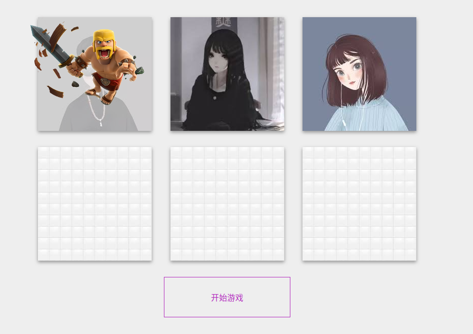

## 喝酒小游戏
KTV包房喝酒小游戏，用户进入包房打开游戏，房主开始游戏后，系统随即选择一名幸运儿给予随即奖惩


## 本地运行
1. [在本地安装redis](https://redis.io/):按照默认安装即可
2. 运行
```shell script
$ git clone https://github.com/zhouzhaoxin/eggdemo.git
$ cd eggdemo
$ npm install 
$ npm run dev
```
3. 打开三个标签模拟三个用户加入demo包房
```
请求路径：
    浏览器打开标签1: http://127.0.0.1:7008/drink?unionid=a&room=demo
    浏览器打开标签2: http://127.0.0.1:7008/drink?unionid=b&room=demo
    浏览器打开标签2: http://127.0.0.1:7008/drink?unionid=d&room=demo
```

## 模拟线上运行（使用docker部署）
系统环境：ubuntu 18.04 bionic amd64 <br>
工作目录：/home/apple/learn/egg

### 安装docker
[docker deb 安装包下载](https://download.docker.com/linux/ubuntu/dists/bionic/pool/stable/amd64/)

### 安装docker-compose
**使用官方提供方式安装**<br>
[docker-compose官方安装地址](https://docs.docker.com/compose/install/)<br>

**自己安装**<br>
如果使用官方提供的方式下载docker-compose过慢，
可以使用下面命令获取docker-compose 地址，然后自己选择其他的方式下载（wget等）
```shell script
$ echo "https://github.com/docker/compose/releases/download/1.25.0/docker-compose-$(uname -s)-$(uname -m)" 
https://github.com/docker/compose/releases/download/1.25.0/docker-compose-Linux-x86_64
```
下载完成后的docker-compose可执行文件放到:/usr/local/bin/docker-compose， 
再赋予其执行权限即可
```shell script
sudo chmod +x /usr/local/bin/docker-compose
```

**配置docker镜像**<br>
官方docker很慢，配置国内镜像可提高docker使用效率
```shell script
$ vim /etc/docker/daemon.json
添加并保存
    {
      "registry-mirrors": [
        "https://dockerhub.azk8s.cn",
        "https://reg-mirror.qiniu.com"
      ]
    }
$ sudo systemctl daemon-reload
$ sudo systemctl restart docker
```


## 参考
[egg官方文档](https://eggjs.org/zh-cn/intro/index.html)

## 目录结构
```
.
├── app 
│   ├── controller // 存放所有的html渲染和restful接口
│   │   ├── game // 游戏控制目录
│   │   │   ├── drink.js // 此文件编写小游戏restful接口
│   │   │   └── home.js // 此文件渲染小游戏前端模板
│   │   └── home.js // 此文件渲染p2p前端模板
│   ├── extend
│   │   └── helper.js // 提供socket返回信息结构化转换拓展
│   ├── io // socket.io接口目录
│   │   ├── controller 
│   │   │   ├── chat.js // p2p socket接口
│   │   │   └── game
│   │   │       └── drink.js // 小游戏socket接口
│   │   └── middleware // socket 中间件，需要在config.default.js中配置使用
│   │       ├── auth.js // socket 进入房间退出房间中间件
│   │       └── packet.js // 作用于每一个数据包（每一条消息）；在生产环境中，通常用于对消息做预处理，又或者是对加密消息的解密等操作
│   ├── middleware // 接口中间件
│   │   ├── drink.js // 小游戏中间件
│   │   └── error_handler.js // 错误处理中间件
│   ├── router.js // 路由文件
│   └── view
│       ├── drink.html // 小游戏
│       ├── home.html // p2p chat
│       └── loading_heart.html // 加载界面
├── app.js // 初始化调用
├── config // 配置文件
│   ├── config.default.js // 默认配置文件
│   └── plugin.js // 插件
├── package.json /
├── package-lock.json
├── readme.md
├── tests // 为了解js使用的测试文件
│   ├── drink.py
│   └── test.js
.
```
## 使用
#### p2p
请求路径为`/`
请求成功后打开命令行，用下边的命令发送消息
```
socket.emit('exchange', {
  target: 'Dkn3UXSu8_jHvKBmAAHW',
  payload: {
    msg : 'test',
  },
});
```
#### 小游戏 restful
请求路径`/api/game/drink` 未完成，但展示了restful的用法

## 注意
在对restful请求参数校验时使用的validate的参数需要参考[传送门](https://github.com/node-modules/parameter)

## 部署

#### 搭建nginx
**启动Nginx临时服务**
```shell script
sudo docker container run -d -p 127.0.0.1:8080:80 --rm --name mynginx nginx
```

**将docker中配置文件拷贝到本地当前目录**
```shell script
$ sudo docker container cp mynginx:/etc/nginx .
# 当前目录会多出一个nginx目录
$ mv nginx conf
$ sudo docker container stop mynginx
```

**启动使用本地nginx配置文件的docker nginx**
```shell script
$ sudo docker container run -d -p 127.0.0.1:8080:80 --rm --name mynginx --volume "$PWD/conf":/etc/nginx nginx
# 此时访问localhost:80可确认安装是否成功
# 关闭nginx可以使用 sudo docker container stop mynginx
$ sudo docker exec mynginx nginx -s reload # 使用此命令重新加载配置文件
```

#### 构建项目
```
$ cd baseDir
$ npm install --production
$ tar -zcvf /home/apple/learn/egg/server/release.tgz .
```

#### docker-compose 查询错误
```shell script
$ docker-compose --verbose up
$ sudo docker exec -it [container-name] sh
```